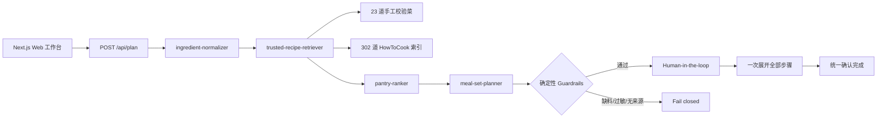

# 开饭啦 · Harness Demo Lite

一个面向 AI 产品经理作品集的 Web Demo：输入冰箱现有食材，系统只从可信完整菜谱中检索可做菜品，在“零新增食材”约束下组合成一顿正常的饭。

## 这版解决了什么

- 不再使用“杂蔬快炒 / 一锅焖”生成模板拼菜。
- 不要求一顿消耗全部库存；用户可单独标记“优先消耗”。
- 缺少必需食材的菜谱不会进入可执行候选。
- 一餐由 1–2 道独立真实菜谱组成，保留原菜名、配方、步骤和来源。
- 时间超限只做诚实提示，不会把复杂菜改写成虚假快手版。
- 做饭步骤一次全部展开，不需要逐条打卡；最后统一点击一次“确认这顿饭完成”。

## Harness 架构



四个项目级 Skill 位于 `.cursor/skills/`：

1. `ingredient-normalizer`：中文食材别名、数量和可选项归一化。
2. `trusted-recipe-retriever`：只召回 HowToCook 与手工金标完整菜谱。
3. `pantry-ranker`：按库存、优先食材、基础调料、时间和口味排序。
4. `meal-set-planner`：把 1–2 道独立菜谱组合成合理一餐。

随后由确定性 Guardrail 复核来源、过敏原、零采购、时间、优先食材覆盖和一餐结构。没有大模型自由生成兜底，因此演示无需 API Key，也不会因模型波动造出不真实的菜。

## 技术栈

- Next.js 16 + React 19 + TypeScript
- Next.js Route Handlers
- 原生 CSS + GSAP 微动效
- localStorage 运行状态恢复
- 302 道 HowToCook 静态索引（Unlicense）
- 23 道手工校验高价值菜谱
- Node Test Runner + `tsx`

## 本地运行

```bash
npm install
npm run dev
```

打开 [http://localhost:3000](http://localhost:3000)。无需环境变量或第三方 API。

## 验证

```bash
npm run typecheck
npm test
npm run build
```

## 部署到 Vercel

1. 在 Vercel 选择 **Add New Project**。
2. 导入 GitHub 仓库 `HYP190524/harness-demo-lite`。
3. 保持自动识别的 Next.js 配置，无需添加环境变量。
4. 点击 **Deploy**。

## 推荐演示脚本

1. 在“按食材找灵感”输入 `鸡腿、土豆、青菜、米饭`，优先消耗填写 `鸡腿、青菜`。
2. 展示候选为 `土豆烧鸡腿 + 清炒青菜` 等独立真实菜品，而不是把四种食材混成怪菜。
3. 指出卡片会明确显示本次使用、留到下一顿、基础调料和新增采购 0。
4. 查看右侧 Trace，解释归一化、检索、排序、一餐组合、Guardrail 和人工审批的职责边界。
5. 确认方案后展示全部做法；最后只点击一次“确认这顿饭完成”。
6. 切到“按菜名查做法”输入 `佛跳墙`，展示真实跨日耗时，而非虚假 30 分钟版本。

## 数据说明

- `data/howtocook-index.json`：从 [HowToCook](https://github.com/Anduin2017/HowToCook) 构建的本地索引，来源说明见 `data/HOWTOCOOK-NOTICE.md`。
- `data/gold-recipes.ts`：23 道人工补齐菜谱，覆盖炒、蒸、煮、炖、煨、炸、烤、凉拌等技法。
- `scripts/build-howtocook-index.mjs`：重新生成索引的脚本。
- `tests/`：验证食材别名、可信召回、零采购闭包、一餐组合与六类 Guardrail。

## Demo 刻意不做

- 登录与多用户数据库
- 图片识别
- 多 Agent
- 购物接口与自动下单
- 营养医学建议

这些能力放在 Roadmap，不进入求职 Demo 的最小可信闭环。
