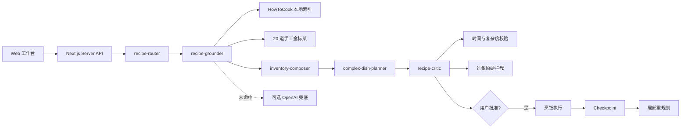

# 开饭 · Harness Demo Lite

一个用于 AI 产品经理作品集的轻量 Web Demo：它不追求功能数量，而是用一条完整的烹饪任务链路展示 Agent harness 的关键能力。

## Demo 能展示什么

1. 用户可选择“按菜名查做法”或“按食材找灵感”。
2. `recipe-router` 识别意图，`recipe-grounder` 检索 302 道 HowToCook 索引与 20 道手工金标菜。
3. `inventory-composer` 把真实菜谱作为技法锚点，在零采购约束下适配用户库存。
4. 食材模式支持“做成一道菜 / 搭配一餐”，并显示库存覆盖率、新增采购和基础调料。
5. `complex-dish-planner` 区分主动时间、总历时和提前准备，不把复杂菜伪造成快手菜。
6. `recipe-critic` 与确定性工具检查时间、复杂度、过敏原和库存闭包。
6. Agent 在执行前暂停，等待用户批准。
7. 用户进入分步烹饪模式，进度自动保存；遇到缺料时只重规划未完成步骤。
8. Trace 面板展示 Skill、检索、guardrail、审批和状态事件。



## 技术栈

- Next.js 16 + React 19
- TypeScript
- 原生 CSS（无 Tailwind 配置负担）
- Lucide 图标
- GSAP + `@gsap/react` 微动效，并兼容 `prefers-reduced-motion`
- 项目内原创 AI 美食主图与透明贴纸插画
- localStorage checkpoint
- Next.js Route Handlers
- HowToCook 静态本地索引（Unlicense），部署后无需第三方菜谱 API
- 20 道手工校验高价值菜，覆盖炒、蒸、煮、炖、煨、炸、烤、凉拌等技法
- 5 个项目级烹饪 Skill，位于 `.cursor/skills/`
- 可选 OpenAI Responses API；默认 Local RAG，未命中时才使用模型兜底

## 本地运行

```bash
npm install
npm run dev
```

打开 [http://localhost:3000](http://localhost:3000)。

项目默认使用本地菜谱索引，所以无需任何密钥或联网请求即可完整演示。

视觉方向借鉴高饱和餐饮杂志与拼贴网页的设计语言，但不复用参考站的品牌、商标或图片。页面使用的素材保存在 `public/assets/`。

## 启用真实模型

复制环境变量示例：

```bash
cp .env.example .env.local
```

配置：

```bash
OPENAI_API_KEY=your_server_side_key
OPENAI_MODEL=gpt-5.6-luna
```

密钥只会在服务端 Route Handler 中读取，不会进入浏览器 bundle。调用使用 Responses API 的 JSON Schema Structured Outputs；具体字段可参考[官方 OpenAI 文档](https://developers.openai.com/api/reference/typescript/resources/beta/subresources/responses/methods/create)。

如果真实模型请求失败，Demo 会显示降级提示并切换到本地引擎，保证面试演示不中断。

## 部署到 Vercel

### 方式一：GitHub 导入

1. 把项目推送到 GitHub。
2. 在 Vercel 选择 `Add New Project`，导入仓库。
3. Framework Preset 会自动识别为 Next.js。
4. 不配置环境变量也能部署完整的 Local RAG Demo。
5. 如需真实模型，在 Vercel Project Settings → Environment Variables 添加 `OPENAI_API_KEY` 和 `OPENAI_MODEL`。
6. 点击 Deploy。

### 方式二：Vercel CLI

```bash
npx vercel
```

## 验证命令

```bash
npm run typecheck
npm test
npm run build
```

## 作品集演示脚本

建议在面试时按这个顺序操作：

1. 切换“按菜名查做法”，输入“丝瓜鸡蛋汤”，展示它返回真实的煮汤流程而不是快炒/一锅焖模板。
2. 输入“佛跳墙”，时间保持 30 分钟，展示传统版与家庭版的跨日准备警告。
3. 指出右侧 Trace 中四个 Skill、索引检索和确定性 Guardrail 的分工。
4. 切换“按食材找灵感”，展示候选技法不同而不是同质化生成。
5. 在审批点解释为什么 Agent 不应该未经确认直接执行。
6. 选择一套方案进入烹饪；完成第一步后用缺料问题触发 checkpoint 局部重规划。
7. 刷新页面，说明运行状态可以恢复。

## 本地数据与测试集

- `data/howtocook-index.json`：由官方 [HowToCook](https://github.com/Anduin2017/HowToCook) 生成的静态索引，来源说明见 `data/HOWTOCOOK-NOTICE.md`。
- `data/gold-recipes.ts`：20 道人工补齐菜谱，包含真实技法、火候提示、主动/总时长与提前准备。
- `scripts/build-howtocook-index.mjs`：重新生成索引的脚本。
- `tests/recipe-engine.test.ts`：验证菜名路由、复杂菜 Guardrail、候选技法差异和八类关键技法覆盖。

## 当前刻意不做的功能

- 登录与多用户数据库
- 图片识别
- 多 Agent
- MCP 与外部购物接口
- 营养医学建议
- 支付、会员或运营系统

这些能力适合放在 Roadmap，而不是最小求职 Demo 中。
