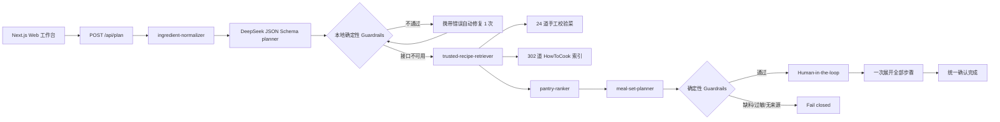

# 开饭啦 · Harness Demo Lite

一个面向 AI 产品经理作品集的 Web Demo：输入冰箱现有食材，系统只从可信完整菜谱中检索可做菜品，在“零新增主要食材”约束下组合成一顿正常的饭。

## 这版解决了什么

- 不再使用“杂蔬快炒 / 一锅焖”生成模板拼菜。
- 默认单菜模式会尝试覆盖全部主要食材；食材较多时可切换为多道菜分开消耗。
- 缺少主要食材的菜谱不会进入可执行候选；油盐酱醋等基础调料默认拥有。
- 特殊调料只做醒目提示，用户也可以在可选设置中明确排除家里没有的调料。
- 一餐可由 1–4 道独立菜谱组成，保留菜名、配方、步骤和来源。
- 时间超限只做诚实提示，不会把复杂菜改写成虚假快手版。
- 做饭步骤一次全部展开，不需要逐条打卡；最后统一点击一次“确认这顿饭完成”。

## Harness 架构



五个规划与校验模块共同组成 Harness：

1. `ingredient-normalizer`：中文食材别名、数量和可选项归一化。
2. `trusted-recipe-retriever`：只召回 HowToCook 与手工金标完整菜谱。
3. `pantry-ranker`：按库存闭包、默认调料预设、时间和口味排序。
4. `meal-set-planner`：按用户选择，把 1–4 道独立菜谱组合成合理一餐。
5. `deepseek-meal-planner`：按 JSON Schema 生成多套候选，不合格时携带校验错误自动修复一次。

随后由确定性 Guardrail 复核来源、过敏原、全部食材覆盖、特殊调料提示、时间、菜品数量和一餐结构。DeepSeek 不可用时自动回退到本地可信菜谱，不会直接展示模型的违规输出。

## 技术栈

- Next.js 16 + React 19 + TypeScript
- Next.js Route Handlers
- 原生 CSS + GSAP 微动效
- localStorage 运行状态恢复
- DeepSeek Responses API + JSON Schema
- 302 道 HowToCook 静态索引（Unlicense，作为本地兜底）
- 24 道手工校验高价值菜谱
- Node Test Runner + `tsx`

## 本地运行

```bash
npm install
npm run dev
```

复制环境变量模板并填写自己的 DeepSeek Key：

```bash
cp .env.example .env.local
```

打开 `.env.local`，替换 `DEEPSEEK_API_KEY` 后运行：

```bash
npm run dev
```

打开 [http://localhost:3000](http://localhost:3000)。未配置 Key 时仍会自动使用本地菜谱兜底。

## 验证

```bash
npm run typecheck
npm test
npm run build
```

## 部署到 Vercel

1. 在 Vercel 选择 **Add New Project**。
2. 导入 GitHub 仓库 `HYP190524/harness-demo-lite`。
3. 在 Environment Variables 添加 `DEEPSEEK_API_KEY`、`DEEPSEEK_BASE_URL=https://api.deepseek.com` 和 `DEEPSEEK_MODEL=deepseek-v4-flash`。
4. 点击 **Deploy**。环境变量变更后需要重新部署。

## 推荐演示脚本

1. 在“按食材找灵感”输入 `鸡腿、土豆`，默认选择“一道菜 · 全部食材”。
2. 再输入 `鸡腿、土豆、青菜`，切换“多道菜 · 分开消耗”，展示候选由独立真实菜品共同覆盖库存。
3. 指出卡片会明确显示全部食材覆盖、默认基础调料和可能需要的特殊调料。
4. 查看右侧 Trace，解释归一化、检索、排序、一餐组合、Guardrail 和人工审批的职责边界。
5. 确认方案后展示全部做法；最后只点击一次“确认这顿饭完成”。
6. 切到“按菜名查做法”输入 `佛跳墙`，展示真实跨日耗时，而非虚假 30 分钟版本。

## 数据说明

- `data/howtocook-index.json`：从 [HowToCook](https://github.com/Anduin2017/HowToCook) 构建的本地索引，来源说明见 `data/HOWTOCOOK-NOTICE.md`。
- `data/gold-recipes.ts`：24 道人工补齐菜谱，覆盖炒、蒸、煮、炖、煨、炸、烤、凉拌等技法。
- `scripts/build-howtocook-index.mjs`：重新生成索引的脚本。
- `tests/`：验证食材别名、可信召回、主要食材闭包、调料预设、一餐组合与七类 Guardrail。

## Demo 刻意不做

- 登录与多用户数据库
- 图片识别
- 多 Agent
- 购物接口与自动下单
- 营养医学建议

这些能力放在 Roadmap，不进入求职 Demo 的最小可信闭环。
